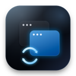

<p align="center">
  
</p>

<h1 align="center">Quick Switch</h1>

<p align="center">
  A fast, native macOS switcher that treats every window as a first-class item.
</p>

<p align="center">
  <a href="https://github.com/wmonk/quick-switch/actions/workflows/ci.yml">
    
  </a>
</p>

Quick Switch has two jobs:

- `Command-Tab` cycles through every switchable window in most-recently-used order.
- `Command-Backquote` cycles through windows belonging to the current application in most-recently-used order.

While the switcher is open, use `Tab`, `J`, or Down Arrow to move forward and backquote, `K`, or Up Arrow to move backward. Press `W` to close the selected window or `Q` to quit its application. Quick Switch asks for confirmation before either action by default; you can turn confirmation off from its menu-bar menu. After closing or quitting, the switcher stays open on the nearest remaining window. Hovering selects a window, clicking activates it, releasing Command activates the selection, and Escape cancels.

It is written in Swift and AppKit. macOS 26 gets a native Liquid Glass surface, with a visual-effect fallback on earlier supported releases.

## Requirements

- macOS 14 or later
- Xcode 26 or later to build from source
- [XcodeGen](https://github.com/yonaskolb/XcodeGen)

## Build and run

```sh
brew install xcodegen
xcodegen generate
open QuickSwitch.xcodeproj
```

Run the `QuickSwitch` scheme, then enable Quick Switch in **System Settings → Privacy & Security → Accessibility** when prompted. The project uses ad-hoc signing by default so it builds without an Apple Developer account. You can select your own Development Team in Xcode if you want a stable signing identity across rebuilds.

If the setup window is still waiting after permission is enabled, click **Restart Quick Switch**. A fresh process usually picks up the new authorization immediately.

Quick Switch runs as a menu-bar utility. Its menu shows the current state and provides shortcuts to Accessibility Settings and Quit.

## Development

Run the test suite from Xcode or from the command line:

```sh
xcodebuild test \
  -project QuickSwitch.xcodeproj \
  -scheme QuickSwitch \
  -destination 'platform=macOS'
```

The built binary supports two development commands:

- `--diagnose` checks Accessibility access, Command-Tab takeover, and the number of discoverable windows without printing window titles.
- `--preview` shows the current switcher without taking over either shortcut in Debug builds.

The Xcode project is generated from `project.yml`. Update that file first, then run `xcodegen generate` and commit both changes.

## Privacy and permissions

Quick Switch requires Accessibility permission to discover and focus windows and to receive global keyboard events. It reads application names and window titles to display the list. It does not record the screen, require Screen Recording permission, send analytics, or make network requests.

Secure Input is a macOS security feature that prevents all other applications from receiving keyboard events while sensitive text is being entered. Quick Switch cannot respond to its shortcuts while Secure Input is active. If an application leaves Secure Input enabled accidentally, quit and reopen that application; logging out or restarting macOS clears the state as a last resort.

## Implementation notes

App Sandbox is intentionally disabled because controlling windows in other applications is incompatible with it. Release builds for direct distribution must be signed with a Developer ID certificate and notarized.

Replacing the Dock-owned Command-Tab shortcut requires the private, dynamically loaded `CGSSetSymbolicHotKeyEnabled` function. This may change or disappear in a future macOS release. Quick Switch fails closed when the symbol is unavailable and restores the native shortcuts when it quits normally and through an `atexit` handler. If it is force-killed or crashes while active, logging out restores macOS's in-memory shortcut state.

## License

Quick Switch is available under the [MIT License](LICENSE).

## Contributing

Bug reports and pull requests are welcome. See [CONTRIBUTING.md](CONTRIBUTING.md) for the development workflow and [SECURITY.md](SECURITY.md) for private vulnerability reporting.
